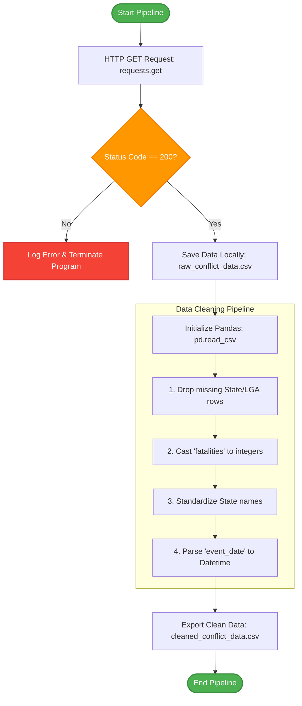

# Spatiotemporal Analysis of Insecurity in Nigeria 🇳🇬

This repository tracks the data gathering and cleaning pipeline for the CPE Club Week 09 Security Analysis project.

# Objectives🎯

The project aims to:

•Analyze the geographical distribution of insecurity incidents across Nigeria.

•Examine temporal trends in security incidents.

•Identify regions experiencing the highest levels of insecurity.

•Visualize findings using charts and graphs.

•Provide data-driven insights that support understanding of insecurity patterns.

# Team Members👥

Member| Responsibility

Chioma| Data Gathering

Anthony| Data Cleaning

Joshua| Data Analysis & Visualization

Goodluck| Documentation & GitHub

Miracle| Presentation & Social Media

Chinonso| Project Integration (Team Lead)

## Stage 3 & 4: Data Pipeline Architecture

Below is the logical flow of how we fetch the raw ACLED conflict data using the `requests` module and clean it using `pandas`.

